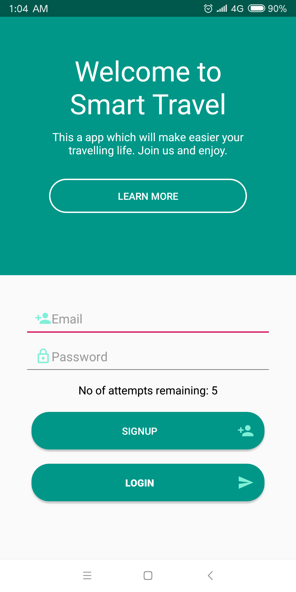
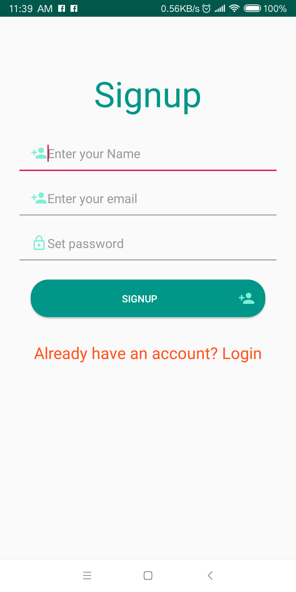
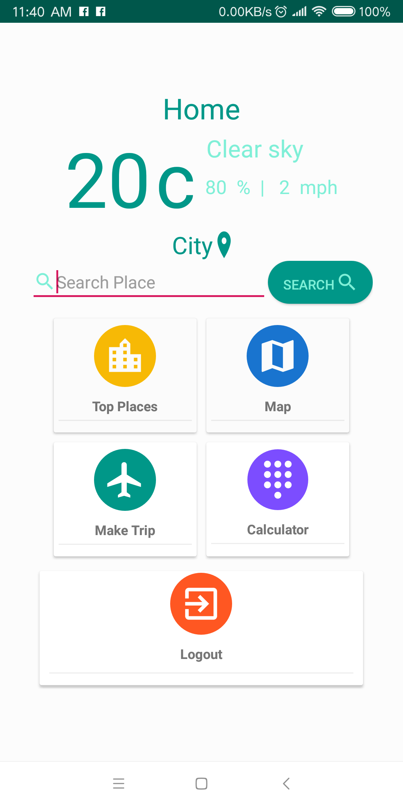
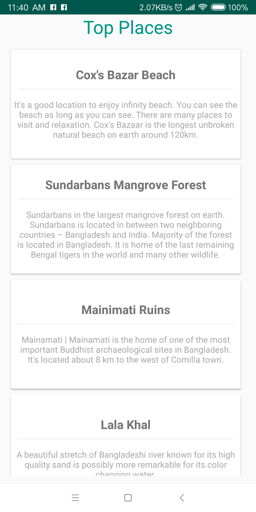
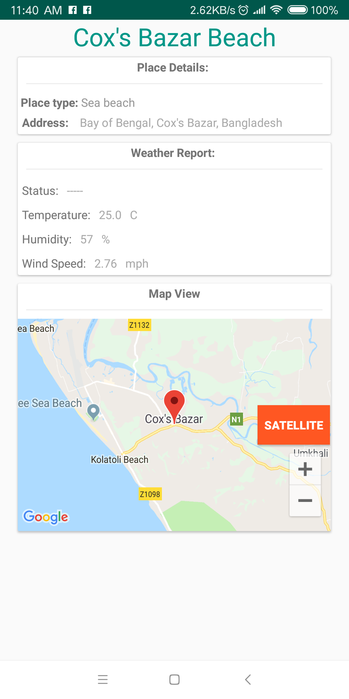
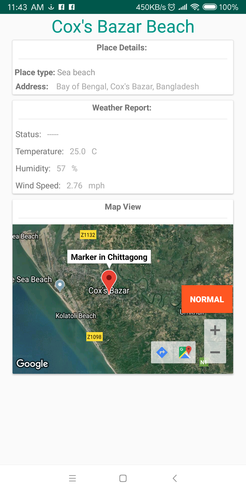
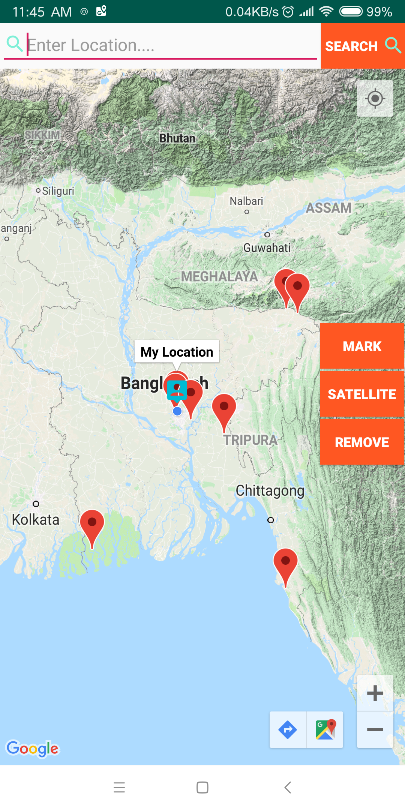

# Smart-Travel

a mobile app. Usign this you can easily find your travelling place. It gives you weather information of that place. Your can view the place using map from this app.

# What are used to develop this app
1. Android Studio
2. Java
3. firebase database
4. weather map API
5. google map

# Screenshots of this app

